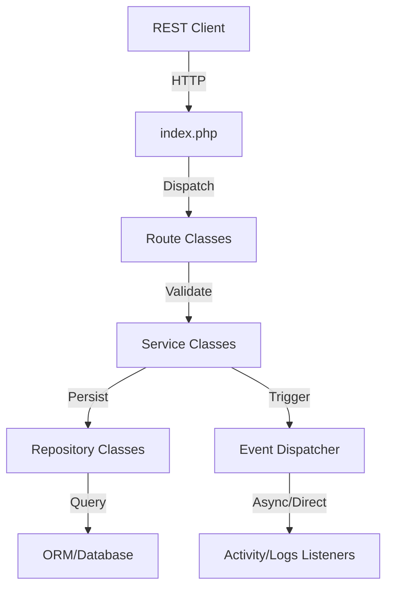

# AliveChMS Codebase Analysis & Audit Report

This report provides a comprehensive, module-by-module analysis of the AliveChMS backend (v2.0.0 Stable). It evaluates the system's architecture, security, module integration, and API surface.

## 1. Architectural Overview

AliveChMS follows a **Layered Service-Oriented Architecture** (SOA) with a clear separation of concerns.

- **System Layer**: Core utilities, DI container, and the ORM.
- **Repository Layer**: Encapsulates all data access logic (`core/*Repository.php`).
- **Service Layer**: Business logic orchestration and validation (`core/*.php`).
- **Routing Layer**: Dispatches HTTP requests to services (`routes/*.php`).
- **Event Layer**: Decouples side effects (logging, notifications) via a Pub/Sub dispatcher.

### Core Strengths
- **Decoupled Architecture**: High modularity allows for easier testing and maintenance.
- **Robust Security**: Multi-layered protection including JWT (Access/Refresh), RBAC, CSRF, and input sanitization.
- **Sophisticated Event System**: The `EventDispatcher` allows the system to remain reactive and decoupled.
- **Standardized Communication**: Use of `BaseRoute` and `ResponseHelper` ensures consistent API responses.

---

## 2. Module Analysis & Assessment

### 2.1 Identity (Auth & Security)
- **Status**: Secure and Stable.
- **Implementation**: JWT-based stateless authentication with `firebase/php-jwt`. Implements RBAC via `Auth::checkPermission()`.
- **Strengths**: Dual tokens (Access/Refresh) and centralized CSRF management.
- **Improvements**: Consider implementing IP-based rate limiting for the login endpoint to prevent brute-force attacks.

### 2.2 People (Members, Families, Visitors, Volunteers)
- **Status**: Functional with legacy gaps.
- **Implementation**: Services like `Family.php` manage complex relationships (Head of Household).
- **Strengths**: Integrated roles for volunteers and detailed relationship tracking.
- **Inconsistencies**:
    - `Visitor::convertToMember` is currently a placeholder/simplified. It needs full integration with `MemberRepository`.
    - Family-specific roles mentioned in `FamilyRepository` are not yet supported by the schema.
- **Improvements**: Complete the visitor conversion logic to preserve historical visit data when a member is created.

### 2.3 Financial (Contributions, Expenses, Budgets)
- **Status**: Enterprise-ready but inconsistent in workflows.
- **Implementation**: Robust transaction handling for multi-table updates (e.g., Budget line items).
- **Strengths**: Formal approval workflows for Expenses and Budgets. Auto-calculation of budget totals.
- **Inconsistencies**:
    - `Expense::review` logs to `expense_approval`, but `Budget::review` does not log to a corresponding table.
    - Money validation is consistent via `MoneyValidator`, but some repositories use raw SQL for aggregation while others use ORM helpers.
- **Improvements**: Standardize approval logging across all financial modules.

### 2.4 Operations (Groups, Events, Dashboard)
- **Status**: Robust.
- **Implementation**: Centralized dashboard logic in `ReportingRepository`. Event attendance tracking.
- **Strengths**: Attendance integrity (prevents deletion of events with data).
- **Redundancies**: `VolunteerRepository` has multiple methods (`getVolunteers`, `getStats`, `getByEvent`) that are effectively identical.
- **Improvements**: Batch attendance processing for larger congregations (currently loops through DB calls).

---

## 3. Integration Map

---

## 4. API Endpoint Audit

### 4.1 Available Endpoints (Derived from Route Definitions)
| Module | Endpoint | Method | Purpose |
| :--- | :--- | :--- | :--- |
| **Auth** | `/auth/login` | POST | Authenticate and get JWT |
| | `/auth/refresh` | POST | Rotate refresh token |
| | `/auth/status` | GET | Check current auth state |
| **Member** | `/member/all` | GET | Paginated list of members |
| | `/member/create` | POST | Register new member |
| | `/member/view/{id}` | GET | Detailed member profile |
| **Family** | `/family/all` | GET | List families |
| | `/family/add-member` | POST | Link member to family |
| **Financial** | `/contribution/create` | POST | Record a gift |
| | `/expense/request` | POST | Submit expense for approval |
| | `/budget/submit` | POST | Submit draft budget |
| **Operations** | `/event/attendance` | POST | Mark check-in |
| | `/dashboard/overview`| GET | Global status report |

### 4.2 Suggested Additions
- **Bulk Import**: `/member/import` (CSV/Excel) for easier onboarding.
- **Audit Logs**: `/system/audit` to view global activity logs via the UI.
- **Sms/Email notifications**: `/communication/send` to broadcast to groups.

### 4.3 Redundant Endpoints
- Older procedural endpoints in `Legacy/` (if any remain) should be strictly blocked by `.htaccess`.
- `Helpers::sendFeedback` is superseded by `ResponseHelper` and should be removed from all service files.

---

## 5. Summary Assessment

**Honest Rating: 8.5/10 (Stable Refactored V2)**

The codebase is exceptionally well-structured for a church management system. It avoids the common mistake of "fat controllers" by pushing logic into services and repositories. The biggest liability currently is the **inconsistency between workflow modules** (Budget vs Expense) and the **placeholder logic** in Visitor-to-Member conversion.

> [!TIP]
> **Priority improvement**: Implement the batch attendance recording in `EventRepository` to optimize performance for large events.
