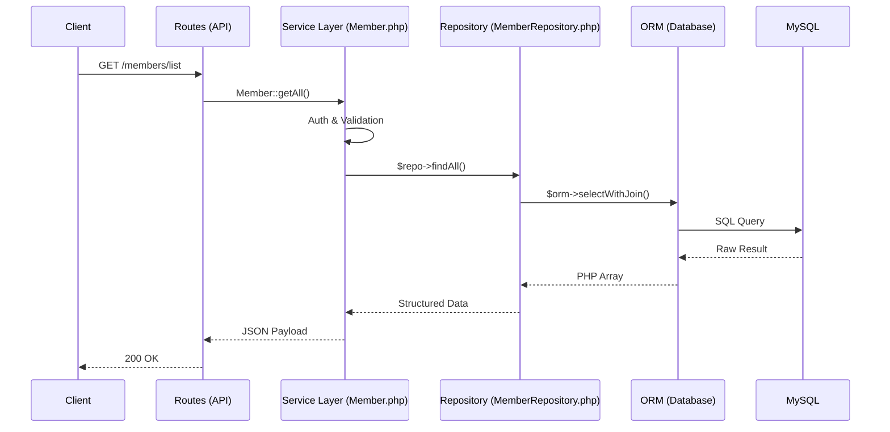

# Backend Architecture & File Relationships

This document explains the technical architecture of the AliveChMS backend. It details the separation of concerns and data flow across the system.

---

## 🔄 The Request Lifecycle

Every request follows a standardized path through the application layers. This ensures that **Routes** handle HTTP, **Services** handle business logic, and **Repositories** handle database persistence.



---

## 🏗 The Layers Explained

### 1. The Route Layer (`routes/`)
* **Role**: Entry Point.
* **Responsibility**: Parses HTTP requests, extracts parameters, and calls the appropriate Service method.
* **Rule**: Zero business logic. No database connections. Every route extends `AliveChMS\Core\System\BaseRoute`.

### 2. The Service Layer (`core/[Domain]/`)
* **Role**: The Brain.
* **Responsibility**: 
    1.  **Validation**: Sanitizes and validates data using `System\Validator`.
    2.  **Security**: Enforces permissions using `Identity\Auth`.
    3.  **Business Logic**: Orchestrates workflows within a specific domain (e.g., `People`, `Financial`).
    4.  **Integration**: Calls multiple repositories if a task spans multiple tables.

### 3. The Repository Layer (`core/[Domain]/...Repository.php`)
* **Role**: The Librarian.
* **Responsibility**: Strictly encapsulates SQL and ORM queries for a specific domain.
* **Specialized Repositories**:
    - `Operations\ReportingRepository`: Centralizes complex analytics and union-based queries.
    - `Identity\AuthRepository`: Dedicated to user sessions and identity persistence.
    - `System\LookupRepository`: A generic engine for simple category tables (Type tables).

---

## 📂 Visual File Map

```
core/
├── People/
│   ├── Member.php           <-- Service: "What happens"
│   └── MemberRepository.php <-- Data: "How it's stored"
├── Identity/
│   ├── Auth.php             <-- Service: Identity Logic
│   └── AuthRepository.php   <-- Data: SQL for Sessions
├── Financial/
│   └── Contribution.php     <-- Service: Financial Logic
├── System/
│   ├── ORM.php              <-- DB Engine: PDO Wrapper
│   └── Application.php      <-- Bootstrap & DI Container
└── Infrastructure/
    └── Cache.php            <-- Cross-cutting concerns
```
