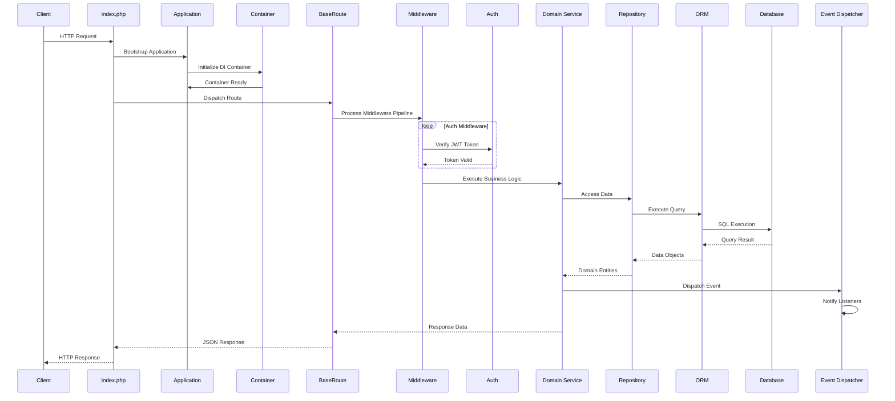
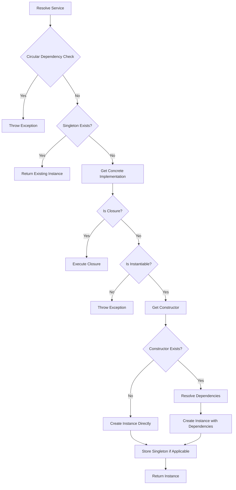
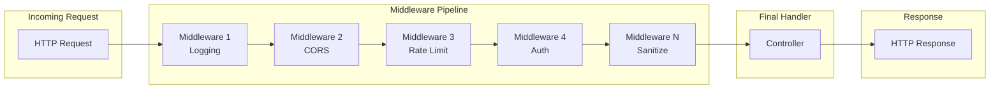
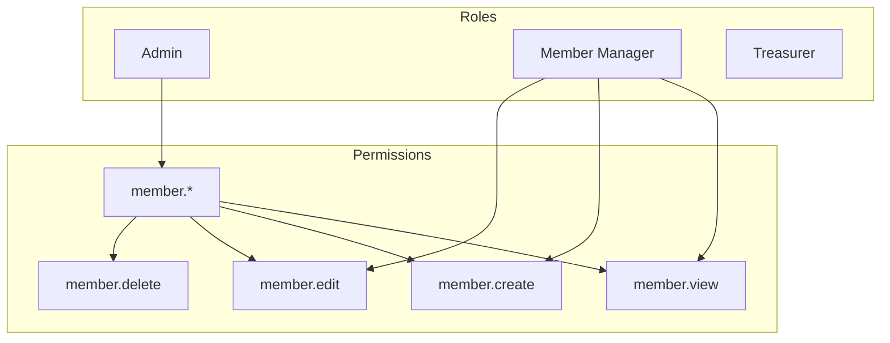
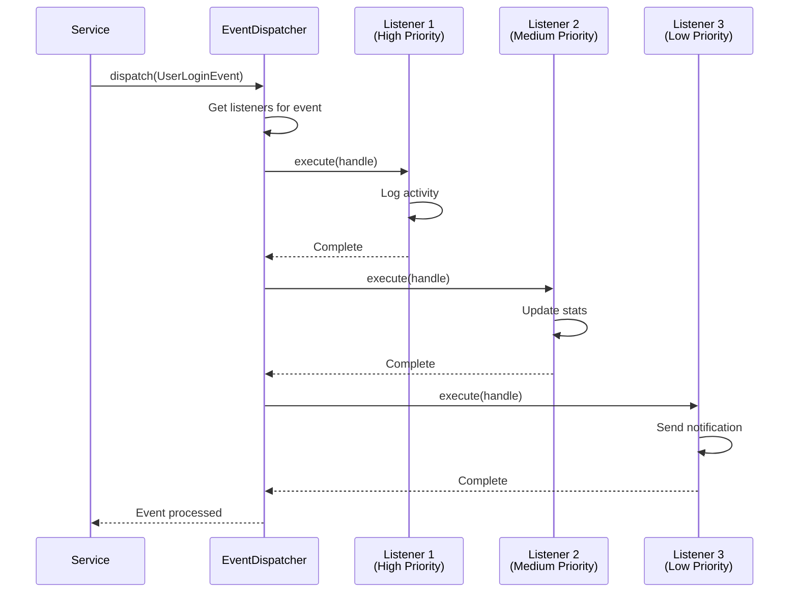
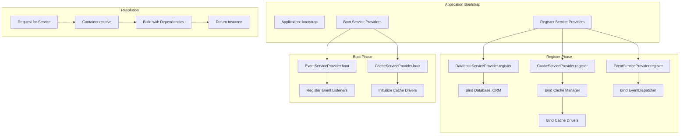
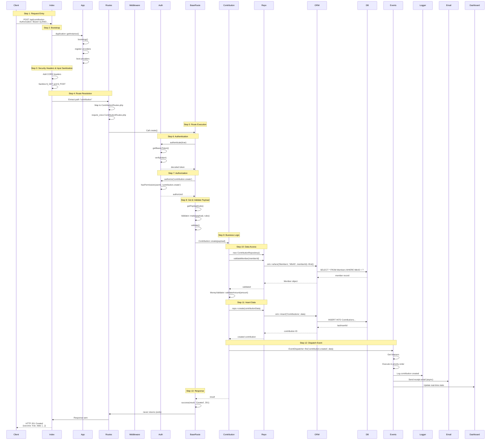
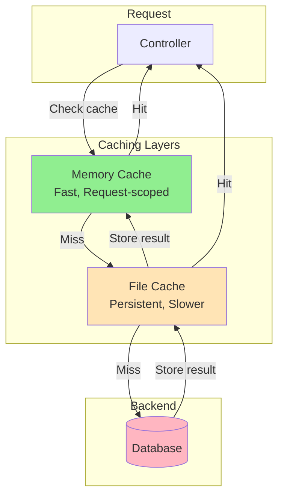

# AliveChMS Comprehensive Architecture Documentation

## Table of Contents

1. [Executive Summary](#1-executive-summary)
2. [Architecture Overview Diagram](#2-architecture-overview-diagram)
3. [System Core Layer](#3-system-core-layer)
4. [HTTP & Routing Layer](#4-http--routing-layer)
5. [Middleware Layer](#5-middleware-layer)
6. [Identity & Security Layer](#6-identity--security-layer)
7. [Business Logic Domain Layers](#7-business-logic-domain-layers)
8. [Infrastructure Layer](#8-infrastructure-layer)
9. [Database & ORM Layer](#9-database--orm-layer)
10. [Events System](#10-events-system)
11. [Service Provider & Dependency Injection](#11-service-provider--dependency-injection)
12. [Request Flow Simulation](#12-request-flow-simulation)
13. [Caching Strategy](#13-caching-strategy)
14. [Design Patterns](#14-design-patterns)

---

## 1. Executive Summary

AliveChMS (Alive Church Management System) is a comprehensive, PHP-based Church Management System designed to handle all aspects of church administration including member management, financial tracking, event coordination, and communication. The system follows a **layered architecture pattern** with clear separation of concerns, making it maintainable, scalable, and testable.

### Core Architectural Principles

- **Domain-Driven Design (DDD)**: Code is organized into domain-specific modules (`People`, `Financial`, `Operations`)
- **Repository Pattern**: Data access is abstracted through repositories, ensuring database logic stays separate from business logic
- **Dependency Injection (DI)**: Lightweight DI container manages all service dependencies
- **Event-Driven Architecture**: Decoupled event system for handling side effects and cross-cutting concerns
- **Middleware Pipeline**: Chainable middleware for HTTP request/response processing
- **PSR-4 Autoloading**: Standards-compliant autoloading for modularity

### Technology Stack

| Layer          | Technology                       |
| -------------- | -------------------------------- |
| Backend        | PHP 8.x                          |
| Database       | MySQL with PDO                   |
| Frontend       | Vue.js 3 + TypeScript            |
| Caching        | File-based + In-memory           |
| Authentication | JWT (JSON Web Tokens)            |
| Authorization  | RBAC (Role-Based Access Control) |

---

## 2. Architecture Overview Diagram

### High-Level System Architecture

```mermaid
graph TB
    subgraph Client["Client Layer"]
        Browser[Browser/Mobile App]
        API[REST API Consumer]
    end

    subgraph Frontend["Presentation Layer (Vue.js)"]
        Vue[Vue.js 3 + TypeScript]
        DesignSystem[Design System Components]
    end

    subgraph Entry["Entry Point"]
        Index[index.php]
    end

    subgraph Core["Core System Layer"]
        App[Application Kernel]
        Container[DI Container]
        Routes[BaseRoute - Route Handler]
    end

    subgraph HTTP["HTTP/Routing Layer"]
        Req[Request]
        Res[Response]
        Router[Router Dispatch]
    end

    subgraph Middleware["Middleware Layer"]
        AuthM[Auth Middleware]
        CorsM[CORS Middleware]
        CsrfM[CSRF Middleware]
        RateM[Rate Limit Middleware]
        SanitizeM[Input Sanitization]
        LogM[Logging Middleware]
    end

    subgraph Identity["Identity/Security Layer"]
        Auth[Auth - JWT Manager]
        RBAC[RBAC - Permissions]
        Tokens[Token Manager]
        Security[CSRF Protection]
    end

    subgraph Business["Business Logic Layer"]
        People[People Domain]
        Financial[Financial Domain]
        Operations[Operations Domain]
    end

    subgraph DataAccess["Data Access Layer"]
        MemberRepo[MemberRepository]
        ContribRepo[ContributionRepository]
        OtherRepo[Other Repositories]
    end

    subgraph ORM["ORM Layer"]
        ORM[ORM - Query Builder]
        PDO[PDO Database]
    end

    subgraph Infrastructure["Infrastructure Layer"]
        Cache[Cache Manager]
        Email[Email Gateway]
        SMS[SMS Gateway]
        RateLimiter[Rate Limiter]
    end

    subgraph Events["Events System"]
        Dispatcher[Event Dispatcher]
        Listeners[Event Listeners]
    end

    Browser --> Vue
    API --> Index
    Index --> App
    App --> Container
    App --> Routes

    Routes --> Req
    Routes --> Middleware
    Middleware --> Identity

    Identity --> Business
    Business --> DataAccess
    DataAccess --> ORM
    ORM --> PDO

    Business --> Events
    Events --> Listeners

    Business --> Infrastructure
    Infrastructure --> Cache
```

### Layer Communication Flow



---

## 3. System Core Layer

The System Core Layer forms the foundation of the entire application, providing essential services for dependency management, application bootstrapping, and global helper functions.

### 3.1 Application Kernel (`core/System/Application.php`)

The `Application` class is the central bootstrap component that manages the application lifecycle. It implements the **Singleton pattern** to ensure only one instance exists throughout the application lifecycle.

**Key Responsibilities:**

- Initializes the Dependency Injection container
- Registers and boots service providers
- Manages application configuration
- Provides static helper methods for service resolution

**Code Example:**

```php
// Bootstrap the application (from index.php)
$app = Application::getInstance();
$app->bootstrap();

// Register a custom service provider
$app->register(CustomServiceProvider::class);

// Resolve a service from the container
$orm = Application::resolve(ORM::class);

// Static helper methods for quick access
$cache = Application::resolve('Cache');
Application::bind('MyService', MyServiceImplementation::class, true);
Application::singleton('EventDispatcher', EventDispatcher::class);
```

**Why this design?** The Application class follows the **Service Locator pattern**, providing a central entry point for all application services while delegating actual service creation to the Container and Service Providers.

### 3.2 Dependency Injection Container (`core/System/Container.php`)

The Container is a lightweight DI container that manages all service dependencies. It uses **Reflection** to automatically resolve constructor dependencies.

**Key Features:**

- Service registration and resolution
- Singleton and factory pattern support
- Automatic constructor injection
- Interface binding
- Circular dependency detection

**Code Example:**

```php
// Get the container instance
$container = Container::getInstance();

// Bind a service (new instance each time)
$container->bind('PaymentGateway', StripeGateway::class);

// Bind as singleton (same instance returned)
$container->singleton('Cache', CacheManager::class);

// Register an existing instance
$container->instance('Config', $configArray);

// Resolve a service (automatically resolves dependencies)
$gateway = $container->resolve('PaymentGateway');

// The container uses reflection to resolve constructor dependencies
class OrderService {
    public function __construct(
        private PaymentGateway $payment,
        private Logger $logger,
        private Cache $cache
    ) {}
}

// This will automatically inject all dependencies
$orderService = $container->resolve(OrderService::class);
```

**Dependency Resolution Process:**



### 3.3 Helper Functions (`core/System/Helpers.php`)

The Helpers class provides utility functions for common operations including:

- Input sanitization
- Date/time formatting
- String manipulation
- Error logging
- Validation utilities

---

## 4. HTTP & Routing Layer

### 4.1 Request Handling (`core/Http/Request.php`)

The Request class encapsulates all HTTP request information, providing a clean interface for accessing request data.

**Capabilities:**

- Query parameters (`$_GET`)
- POST data (`$_POST`)
- JSON body parsing
- Headers and cookies
- File uploads
- Route parameters
- Request method detection

### 4.2 Response Handling (`core/Http/Response.php`)

Standardized response formats for consistent API output.

**Usage Examples:**

```php
// Success response
Response::success(['data' => $results], 'Operation successful');

// Error response
Response::error('Invalid input', 400, ['errors' => $validationErrors]);

// Paginated response
Response::paginated($data, $total, $page, $limit);

// JSON response with custom headers
Response::json($data, 200, ['X-Custom-Header' => 'value']);
```

### 4.3 Route Dispatch (`core/System/BaseRoute.php`)

The `BaseRoute` class is the **centralized route handler** that eliminates duplication across all route files. All route classes should extend this base class.

**Unified Features Provided:**

```php
abstract class BaseRoute {
    // Authentication & Authorization
    protected static function authenticate(bool $required = true): bool;
    protected static function authorize(string $permission): void;

    // Request Data
    protected static function getPayload(array $rules = []): array;
    protected static function getIdFromPath(array $pathParts, int $position): int;
    protected static function getPagination(int $defaultLimit = 10): array;
    protected static function getFilters(array $allowedFilters): array;

    // Database Operations
    protected static function beginTransaction(): void;
    protected static function commitTransaction(): void;
    protected static function rollbackTransaction(): void;
    protected static function withTransaction(callable $operation): mixed;

    // Rate Limiting
    protected static function rateLimit(string $identifier = '', int $maxAttempts = 60): void;

    // Response Helpers
    protected static function success($data = null, string $message = 'Success'): never;
    protected static function paginated(array $data, int $total, int $page, int $limit): never;
    protected static function error(string $message, int $code = 400): never;

    // Cache Control
    protected static function setCacheHeaders(int $maxAge = 300): void;
    protected static function disableCache(): void;
}
```

**Example Route Implementation:**

```php
class MemberRoutes extends BaseRoute {

    // GET /api/member - List all members
    public static function getAll(): void {
        // Authenticate (optional - set to false for public endpoints)
        self::authenticate();

        // Get pagination
        [$page, $limit, $offset] = self::getPagination(20, 100);

        // Get allowed filters
        $filters = self::getFilters(['status', 'membership_type', 'search']);

        // Access data via repository
        $repo = new MemberRepository();
        $members = $repo->paginate($page, $limit, $filters);
        $total = $repo->count($filters);

        // Return paginated response
        self::paginated($members, $total, $page, $limit);
    }

    // POST /api/member - Create new member
    public static function create(): void {
        // Require authentication
        self::authenticate(true);

        // Check permission
        self::authorize('member.create');

        // Get and validate payload
        $payload = self::getPayload([
            'first_name' => 'required|string|max:50',
            'last_name' => 'required|string|max:50',
            'email' => 'required|email',
            'phone' => 'required|string'
        ]);

        // Execute within transaction
        $result = self::withTransaction(function($orm) use ($payload) {
            return Member::create($payload);
        });

        self::success($result, 'Member created successfully', 201);
    }
}
```

### 4.4 Route Mapping (from `index.php`)

```php
// Master route map defines section-to-file mappings
$routes = [
    'auth'            => 'AuthRoutes.php',
    'member'          => 'MemberRoutes.php',
    'family'          => 'FamilyRoutes.php',
    'contribution'    => 'ContributionRoutes.php',
    'pledge'          => 'PledgeRoutes.php',
    'expense'         => 'ExpenseRoutes.php',
    'event'           => 'EventRoutes.php',
    'group'           => 'GroupRoutes.php',
    'role'            => 'RoleRoutes.php',
    // ... more routes
];

// URL structure: /{section}/{resource}/{id}/{action}
// Example: /member/123/update
```

---

## 5. Middleware Layer

The Middleware Pipeline provides **chainable middleware** for processing HTTP requests, implementing the **Chain of Responsibility pattern**.

### 5.1 Middleware Pipeline (`core/Http/MiddlewarePipeline.php`)

```php
// Create middleware pipeline
$pipeline = new MiddlewarePipeline();

// Add middleware (order matters!)
$pipeline->add(new LoggingMiddleware());      // 1. Log request
$pipeline->add(new CorsMiddleware());         // 2. Handle CORS
$pipeline->add(new CsrfMiddleware());          // 3. CSRF protection
$pipeline->add(new RateLimitMiddleware());    // 4. Rate limiting
$pipeline->add(new InputSanitizationMiddleware()); // 5. Sanitize input
$pipeline->add(new AuthMiddleware());          // 6. Authentication

// Execute pipeline
$response = $pipeline->execute($request, function($req) {
    // This is the final handler (controller)
    return $controller->handle($req);
});
```

**How It Works:**



### 5.2 Available Middleware

| Middleware                      | File                                                                                                              | Purpose                                      |
| ------------------------------- | ----------------------------------------------------------------------------------------------------------------- | -------------------------------------------- |
| **AuthMiddleware**              | [`core/Http/Middleware/AuthMiddleware.php`](../core/Http/Middleware/AuthMiddleware.php)                           | JWT token validation and user authentication |
| **CorsMiddleware**              | [`core/Http/Middleware/CorsMiddleware.php`](../core/Http/Middleware/CorsMiddleware.php)                           | Cross-Origin Resource Sharing handling       |
| **CsrfMiddleware**              | [`core/Http/Middleware/CsrfMiddleware.php`](../core/Http/Middleware/CsrfMiddleware.php)                           | CSRF token protection                        |
| **InputSanitizationMiddleware** | [`core/Http/Middleware/InputSanitizationMiddleware.php`](../core/Http/Middleware/InputSanitizationMiddleware.php) | XSS prevention and input sanitization        |
| **LoggingMiddleware**           | [`core/Http/Middleware/LoggingMiddleware.php`](../core/Http/Middleware/LoggingMiddleware.php)                     | Request/response logging                     |
| **RateLimitMiddleware**         | [`core/Http/Middleware/RateLimitMiddleware.php`](../core/Http/Middleware/RateLimitMiddleware.php)                 | API rate limiting                            |

**Middleware Implementation Pattern:**

```php
class AuthMiddleware implements Middleware {

    public function execute(Request $request, callable $next): Response {
        // Before passing to next middleware/controller

        $token = Auth::getBearerToken();

        if (!$token) {
            return Response::error('Authorization required', 401);
        }

        $decoded = Auth::verify($token);

        if ($decoded === false) {
            return Response::error('Invalid token', 401);
        }

        // Store user info in request for later use
        $request->setUserId($decoded['user_id']);

        // Call the next middleware in the chain
        return $next($request);
    }

    public function getPriority(): int {
        return 100; // Higher = runs first (except logging which is typically 0)
    }
}
```

---

## 6. Identity & Security Layer

### 6.1 Authentication (`core/Identity/Auth.php`)

The Auth class provides **JWT-based authentication** using the Firebase JWT library.

**Key Features:**

- Access tokens (30-minute TTL)
- Refresh tokens (24-hour TTL)
- Token verification and validation
- User credential validation

**Code Examples:**

```php
// User login - returns tokens
$credentials = Auth::login($username, $password);
// Returns: ['access_token', 'refresh_token', 'user']

// Verify token
$decoded = Auth::verify($token);
if ($decoded) {
    $userId = $decoded['user_id'];
    $username = $decoded['username'];
}

// Generate new access token from refresh token
$tokens = Auth::refreshAccessToken($refreshToken);

// Get current authenticated user ID
$userId = Auth::getCurrentUserId();

// Validate password
$isValid = Auth::validatePassword($password, $storedHash);
```

**Token Structure:**

```php
// Access Token Payload
[
    'iat' => 1700000000,           // Issued at
    'exp' => 1700001800,           // Expires (30 minutes)
    'user_id' => 123,             // User ID
    'username' => 'john.doe',      // Username
    'role' => ['admin', 'finance'] // User roles
]
```

### 6.2 Token Manager (`core/Security/TokenManager.php`)

Manages token lifecycle:

- Access tokens (short-lived, 30 minutes)
- Refresh tokens (long-lived, 24 hours)
- HttpOnly cookies for secure storage
- Token rotation

### 6.3 Role-Based Access Control (`core/Identity/RBAC.php`)

RBAC provides **granular permission management** with hierarchical permissions.

```php
// Check if user has specific permission
if (RBAC::hasPermission($userId, 'member.create')) {
    // Allow operation
}

// Check if user has any of multiple permissions
if (RBAC::hasAnyPermission($userId, ['member.create', 'member.edit', 'admin'])) {
    // Allow operation
}

// Get all user permissions
$permissions = RBAC::getUserPermissions($userId);

// Assign role to user
RBAC::assignRole($userId, $roleId, $assignedBy);

// Revoke role from user
RBAC::revokeRole($userId, $roleId);

// Check if role exists
$roleExists = RBAC::roleExists('Treasurer');
```

**Permission Hierarchy:**



### 6.4 Permission Cache (`core/Identity/PermissionCache.php`)

For performance optimization, permissions are cached in memory:

```php
// Get permissions (cached)
$permissions = PermissionCache::getUserPermissions($userId);

// Clear user cache (on permission change)
PermissionCache::clearUserCache($userId);

// Clear all cache
PermissionCache::clearAll();
```

---

## 7. Business Logic Domain Layers

### 7.1 People Domain (`core/People/`)

Manages church members, families, visitors, and volunteers.

**Key Classes:**

| Class                | File                                                                      | Description                     |
| -------------------- | ------------------------------------------------------------------------- | ------------------------------- |
| **Member**           | [`core/People/Member.php`](../core/People/Member.php)                     | Member CRUD, profile management |
| **MemberRepository** | [`core/People/MemberRepository.php`](../core/People/MemberRepository.php) | Data access for members         |
| **MemberStats**      | [`core/People/MemberStats.php`](../core/People/MemberStats.php)           | Membership statistics           |
| **Family**           | [`core/People/Family.php`](../core/People/Family.php)                     | Family/household management     |
| **Visitor**          | [`core/People/Visitor.php`](../core/People/Visitor.php)                   | Guest tracking                  |
| **Volunteer**        | [`core/People/Volunteer.php`](../core/People/Volunteer.php)               | Volunteer management            |
| **Milestone**        | [`core/People/MemberMilestone.php`](../core/People/MemberMilestone.php)   | Life events (baptism, marriage) |

**Usage Example:**

```php
// Create a new member
$member = Member::create([
    'first_name' => 'John',
    'last_name' => 'Doe',
    'email' => 'john@example.com',
    'phone' => '0551234567',
    'date_of_birth' => '1990-01-15',
    'membership_type_id' => 1
]);

// Get member statistics
$stats = MemberStats::getOverview();

// Search members
$members = MemberRepository::search('John', $page, $limit);
```

### 7.2 Financial Domain (`core/Financial/`)

Handles all church financial operations including tithes, offerings, pledges, and expenses.

**Key Classes:**

| Class                      | File                                                                                        | Description          |
| -------------------------- | ------------------------------------------------------------------------------------------- | -------------------- |
| **Contribution**           | [`core/Financial/Contribution.php`](../core/Financial/Contribution.php)                     | Tithes & offerings   |
| **ContributionRepository** | [`core/Financial/ContributionRepository.php`](../core/Financial/ContributionRepository.php) | Data access          |
| **ContributionStats**      | [`core/Financial/ContributionStats.php`](../core/Financial/ContributionStats.php)           | Financial statistics |
| **Pledge**                 | [`core/Financial/Pledge.php`](../core/Financial/Pledge.php)                                 | Planned giving       |
| **Expense**                | [`core/Financial/Expense.php`](../core/Financial/Expense.php)                               | Church expenses      |
| **Budget**                 | [`core/Financial/Budget.php`](../core/Financial/Budget.php)                                 | Budget management    |

**Financial Flow Example:**

```php
// Record a contribution
$contribution = Contribution::create([
    'amount' => 1000.00,
    'date' => '2024-01-15',
    'member_id' => 123,
    'contribution_type_id' => 1, // Tithe
    'payment_method_id' => 1,    // Cash
    'fiscal_year_id' => 2024
]);

// Create a pledge
Pledge::create([
    'member_id' => 123,
    'pledge_type_id' => 1,
    'amount' => 12000.00,
    'start_date' => '2024-01-01',
    'end_date' => '2024-12-31'
]);

// Record an expense
Expense::create([
    'description' => 'Office Supplies',
    'amount' => 250.00,
    'category_id' => 5,
    'date' => '2024-01-20',
    'vendor' => 'Office Depot'
]);

// Get financial reports
$report = ReportingRepository::getContributionSummary($startDate, $endDate);
$report = ReportingRepository::getExpenseSummary($startDate, $endDate);
```

### 7.3 Operations Domain (`core/Operations/`)

Manages church events, groups, communications, and documents.

**Key Classes:**

| Class             | File                                                                        | Description               |
| ----------------- | --------------------------------------------------------------------------- | ------------------------- |
| **Event**         | [`core/Operations/Event.php`](../core/Operations/Event.php)                 | Church events & services  |
| **Group**         | [`core/Operations/Group.php`](../core/Operations/Group.php)                 | Small groups & ministries |
| **GroupType**     | [`core/Operations/GroupType.php`](../core/Operations/GroupType.php)         | Group classification      |
| **Communication** | [`core/Operations/Communication.php`](../core/Operations/Communication.php) | Email & SMS messaging     |
| **Document**      | [`core/Operations/Document.php`](../core/Operations/Document.php)           | File management           |

---

## 8. Infrastructure Layer

### 8.1 Caching System

See [Section 13: Caching Strategy](#13-caching-strategy) for detailed documentation.

### 8.2 Rate Limiter (`core/Infrastructure/RateLimiter.php`)

```php
// Enforce rate limit
RateLimiter::enforce($identifier, $maxAttempts, $windowSeconds);

// Check if rate limited (without enforcing)
$canProceed = RateLimiter::attempt($identifier, $maxAttempts, $windowSeconds);

// Get remaining attempts
$remaining = RateLimiter::remaining($identifier, $maxAttempts);

// Example: 60 requests per minute per IP
RateLimiter::enforce(
    Helpers::getClientIp(),  // Use client IP
    60,                      // 60 requests
    60                       // Per 60 seconds
);
```

### 8.3 Email Gateway (`core/Infrastructure/EmailGateway.php`)

```php
// Send email
EmailGateway::send([
    'to' => 'member@example.com',
    'subject' => 'Welcome to Alive Church',
    'body' => '<h1>Welcome!</h1><p>We are glad to have you...</p>',
    'from' => 'noreply@alivechurch.org'
]);

// Send templated email
EmailGateway::sendTemplate('welcome', [
    'to' => 'member@example.com',
    'data' => ['name' => 'John']
]);
```

### 8.4 SMS Gateway (`core/Infrastructure/SMSGateway.php`)

```php
// Send SMS
SMSGateway::send([
    'to' => '+233551234567',
    'message' => 'Your verification code is: 123456'
]);
```

---

## 9. Database & ORM Layer

### 9.1 ORM (`core/System/ORM.php`)

The ORM provides a secure, PDO-based interface for database operations with **automatic SQL injection prevention**.

**Key Features:**

- Prepared statements for all queries
- Automatic identifier quoting
- Transaction support
- Soft delete functionality
- Query logging

**Basic CRUD Operations:**

```php
// Initialize ORM
$orm = ORM::getInstance();

// INSERT
$id = $orm->insert('Members', [
    'FirstName' => 'John',
    'LastName' => 'Doe',
    'Email' => 'john@example.com',
    'CreatedAt' => date('Y-m-d H:i:s')
]);

// SELECT one
$member = $orm->where('Members', 'MbrID', $id)->first();

// SELECT all
$members = $orm->where('Members', 'MembershipStatus', 'Active')->get();

// UPDATE
$orm->where('Members', 'MbrID', $id)->update('Members', [
    'Phone' => '0551234567'
]);

// DELETE (soft delete)
$orm->where('Members', 'MbrID', $id)->delete('Members');

// Hard delete
$orm->where('Members', 'MbrID', $id)->forceDelete('Members');
```

**Query Builder:**

```php
$results = QueryBuilder::table('Members')
    ->select('MbrID', 'FirstName', 'LastName', 'Email')
    ->where('MembershipStatus', 'Active')
    ->where('Age', '>=', 18)
    ->orderBy('LastName', 'ASC')
    ->orderBy('FirstName', 'ASC')
    ->limit(50)
    ->offset(0)
    ->get();

// With JOIN
$results = QueryBuilder::table('Members', 'm')
    ->select('m.*', 'f.FamilyName')
    ->leftJoin('Families f', 'm.FamilyID', '=', 'f.FamilyID')
    ->where('m.MembershipStatus', 'Active')
    ->get();
```

### 9.2 Transaction Management:

```php
$orm = new ORM();

try {
    $orm->beginTransaction();

    // Multiple operations in a single transaction
    $orm->insert('Contributions', $contributionData);
    $orm->update('Members', $memberUpdateData);
    $orm->insert('AuditLogs', $auditData);

    $orm->commit();
} catch (Exception $e) {
    $orm->rollBack();
    throw $e;
}
```

### 9.3 Migration System (`core/Database/`)

```php
// Create migration
class CreateMembersTable extends Migration {
    public function up() {
        $this->schema->create('Members', function(Blueprint $table) {
            $table->increments('MbrID');
            $table->string('FirstName', 50);
            $table->string('LastName', 50);
            $table->string('Email')->unique();
            $table->string('Phone', 20)->nullable();
            $table->integer('FamilyID')->unsigned()->nullable();
            $table->enum('MembershipStatus', ['Active', 'Inactive', 'Pending']);
            $table->timestamps();

            $table->foreign('FamilyID')
                  ->references('FamilyID')
                  ->on('Families')
                  ->onDelete('set null');
        });
    }

    public function down() {
        $this->schema->drop('Members');
    }
}
```

---

## 10. Events System

The Event System implements the **Observer pattern** for loose coupling between components.

### 10.1 Event Dispatcher (`core/Events/EventDispatcher.php`)

Central event management with priority-based execution.

```php
// Get dispatcher instance
$dispatcher = EventDispatcher::getInstance();

// Register event listener
$dispatcher->listen('user.login', function(Event $event) {
    $userId = $event->getData('user_id');
    Logger::info("User logged in: $userId");
});

// Dispatch an event
$event = new UserLoginEvent(['user_id' => 123, 'ip' => '192.168.1.1']);
$dispatcher->dispatch($event);

// Static helper
EventDispatcher::fire('user.login', ['user_id' => 123]);
```

### 10.2 Event Classes

All events extend the base `Event` class:

```php
class UserLoginEvent extends Event {
    public function getName(): string {
        return 'user.login';
    }
}

// Usage
$event = new UserLoginEvent([
    'user_id' => 123,
    'username' => 'john.doe',
    'ip_address' => '192.168.1.100',
    'user_agent' => $_SERVER['HTTP_USER_AGENT'] ?? ''
]);
```

### 10.3 Event Listeners

```php
class UserActivityLogger extends AbstractEventListener {
    public function handle(Event $event): void {
        if ($event instanceof UserLoginEvent) {
            Logger::logAuth('login', $event->getData('user_id'));
            // Update last login, send welcome email, etc.
        }

        if ($event instanceof UserLogoutEvent) {
            Logger::logAuth('logout', $event->getData('user_id'));
        }
    }

    public function getPriority(): int {
        return 50; // Higher priority runs first
    }
}
```

### 10.4 Available Events

| Event             | Class                                                                                 | Description         |
| ----------------- | ------------------------------------------------------------------------------------- | ------------------- |
| User Login        | [`core/Events/UserLoginEvent.php`](../core/Events/UserLoginEvent.php)                 | User authenticated  |
| User Logout       | [`core/Events/UserLogoutEvent.php`](../core/Events/UserLogoutEvent.php)               | User logged out     |
| User Registration | [`core/Events/UserRegistrationEvent.php`](../core/Events/UserRegistrationEvent.php)   | New user registered |
| Profile Update    | [`core/Events/UserProfileUpdateEvent.php`](../core/Events/UserProfileUpdateEvent.php) | Profile changed     |
| Password Change   | [`core/Events/PasswordChangeEvent.php`](../core/Events/PasswordChangeEvent.php)       | Password updated    |
| HTTP Request      | [`core/Events/HttpRequestEvent.php`](../core/Events/HttpRequestEvent.php)             | Incoming request    |
| HTTP Response     | [`core/Events/HttpResponseEvent.php`](../core/Events/HttpResponseEvent.php)           | Outgoing response   |
| Database Query    | [`core/Events/DatabaseQueryEvent.php`](../core/Events/DatabaseQueryEvent.php)         | Query executed      |
| Error             | [`core/Events/ErrorEvent.php`](../core/Events/ErrorEvent.php)                         | Error occurred      |
| Cache Hit         | [`core/Events/CacheHitEvent.php`](../core/Events/CacheHitEvent.php)                   | Cache retrieved     |
| Cache Miss        | [`core/Events/CacheMissEvent.php`](../core/Events/CacheMissEvent.php)                 | Cache not found     |

### 10.5 Event Flow



---

## 11. Service Provider & Dependency Injection

### 11.1 Service Providers

Service Providers register services with the DI container and perform bootstrapping.

**Base Provider Class (`core/System/ServiceProvider.php`):**

```php
class MyServiceProvider extends ServiceProvider {

    // Register services - called first
    public function register(): void {
        // Bind interfaces to implementations
        $this->container->singleton(CacheInterface::class, CacheManager::class);

        // Register singletons
        $this->container->singleton('Logger', Logger::class);

        // Register factories
        $this->container->bind('Session', SessionFactory::class);
    }

    // Boot services - called after all registers
    public function boot(): void {
        // Initialize services that need other services
        $cache = $this->container->resolve('Cache');
        $logger = $this->container->resolve('Logger');

        // Configure anything needed
    }
}
```

### 11.2 Core Service Providers

| Provider                     | File                                                                                            | Services                          |
| ---------------------------- | ----------------------------------------------------------------------------------------------- | --------------------------------- |
| **CoreServiceProvider**      | [`core/Providers/CoreServiceProvider.php`](../core/Providers/CoreServiceProvider.php)           | Helpers, Settings, ResponseHelper |
| **DatabaseServiceProvider**  | [`core/Providers/DatabaseServiceProvider.php`](../core/Providers/DatabaseServiceProvider.php)   | Database, ORM                     |
| **EventServiceProvider**     | [`core/Providers/EventServiceProvider.php`](../core/Providers/EventServiceProvider.php)         | EventDispatcher, Listeners        |
| **CacheServiceProvider**     | [`core/Providers/CacheServiceProvider.php`](../core/Providers/CacheServiceProvider.php)         | CacheManager, Drivers             |
| **EntityServiceProvider**    | [`core/Providers/EntityServiceProvider.php`](../core/Providers/EntityServiceProvider.php)       | Repositories                      |
| **MigrationServiceProvider** | [`core/Providers/MigrationServiceProvider.php`](../core/Providers/MigrationServiceProvider.php) | MigrationManager                  |

### 11.3 Dependency Injection Flow



---

## 12. Request Flow Simulation

Here's a complete step-by-step trace of an HTTP request from entry to response:

### Request: `POST /api/contribution` (Create Contribution)



### Code-Level Flow

```php
// =============================================
// index.php - Entry Point
// =============================================

// Bootstrap application
$app = Application::getInstance();
$app->bootstrap();

// Security headers
header('Content-Type: application/json');
Helpers::addCorsHeaders();

// Extract route
$path = $_GET['path'] ?? '';
$pathParts = explode('/', trim($path, '/'));
$section = $pathParts[0];

// Route to handler
$routes = [
    'contribution' => 'ContributionRoutes.php',
    // ...
];
require_once __DIR__ . '/routes/' . $routes[$section];


// =============================================
// ContributionRoutes.php - Route Handler
// =============================================

class ContributionRoutes extends BaseRoute {
    public static function create(): void {
        // 1. Authenticate
        self::authenticate(true);

        // 2. Authorize
        self::authorize('contribution.create');

        // 3. Get payload with validation
        $payload = self::getPayload([
            'amount' => 'required|numeric',
            'member_id' => 'required|numeric',
            'contribution_type_id' => 'required|numeric',
            'date' => 'required|date'
        ]);

        // 4. Execute with transaction
        $result = self::withTransaction(function($orm) use ($payload) {
            return Contribution::create($payload);
        });

        // 5. Return success
        self::success($result, 'Contribution recorded successfully', 201);
    }
}


// =============================================
// Contribution.php - Domain Service
// =============================================

class Contribution {
    public static function create(array $data): array {
        $repo = new ContributionRepository();

        // Validate input
        Helpers::validateInput($data, [...]);

        // Validate amount
        $amount = MoneyValidator::validateAmount($data['amount']);

        // Create record
        $id = $repo->create([
            'Amount' => $amount,
            'MemberID' => $data['member_id'],
            'ContributionTypeID' => $data['contribution_type_id'],
            'Date' => $data['date'],
            'CreatedBy' => Auth::getCurrentUserId()
        ]);

        // Dispatch event
        EventDispatcher::fire('contribution.created', [
            'contribution_id' => $id,
            'member_id' => $data['member_id'],
            'amount' => $amount
        ]);

        return ['id' => $id, 'status' => 'success'];
    }
}
```

---

## 13. Caching Strategy

AliveChMS implements a **multi-layer caching system** with automatic fallback and tag-based invalidation.

### 13.1 Cache Manager (`core/Infrastructure/Cache/CacheManager.php`)

```php
// Basic usage
Cache::set('key', 'value', 3600);  // Set with TTL (seconds)
$value = Cache::get('key');        // Get value
$value = Cache::get('key', 'default'); // With default

// Check existence
if (Cache::has('key')) { /* ... */ }

// Delete
Cache::forget('key');
Cache::flush();  // Clear all

// Remember pattern (cache or execute)
$value = Cache::remember('key', function() {
    return expensiveDatabaseCall();
}, 3600);

// Driver switching
Cache::driver('memory')->set('key', 'value');  // In-memory
Cache::driver('file')->set('key', 'value');   // File-based
```

### 13.2 Cache Drivers

| Driver     | Class                                                                                         | Use Case                              |
| ---------- | --------------------------------------------------------------------------------------------- | ------------------------------------- |
| **Memory** | [`core/Infrastructure/Cache/MemoryDriver.php`](../core/Infrastructure/Cache/MemoryDriver.php) | Fast, non-persistent (request-scoped) |
| **File**   | [`core/Infrastructure/Cache/FileDriver.php`](../core/Infrastructure/Cache/FileDriver.php)     | Persistent, slower, disk-based        |

### 13.3 Cache Configuration

```php
// Default configuration
$config = [
    'default' => 'file',
    'drivers' => [
        'file' => [
            'driver' => 'file',
            'cache_dir' => __DIR__ . '/../../cache/data',
            'tag_dir' => __DIR__ . '/../../cache/tags'
        ],
        'memory' => [
            'driver' => 'memory',
            'max_memory' => 50 * 1024 * 1024  // 50MB
        ]
    ],
    'fallback_enabled' => true,
    'fallback_driver' => 'memory'
];
```

### 13.4 Tag-Based Invalidation

```php
// Tag a cached item
Cache::tags(['members', 'active'])->set('member_123', $memberData);

// Invalidate by tag
Cache::tags(['members'])->flush();  // Clear all member cache

// Invalidate multiple tags
Cache::tags(['members', 'finance'])->flush();
```

### 13.5 Caching Layers



### 13.6 What to Cache

| Type                 | Examples                 | TTL          |
| -------------------- | ------------------------ | ------------ |
| **Configuration**    | Settings, lookup values  | 1 hour +     |
| **Reference Data**   | Membership types, groups | 24 hours     |
| **User Permissions** | RBAC permissions         | Session      |
| **Statistics**       | Member counts, totals    | 5-15 minutes |
| **API Responses**    | Dashboard data           | 1-5 minutes  |
| **Database Queries** | Expensive joins          | As needed    |

---

## 14. Design Patterns

AliveChMS uses several design patterns throughout the codebase:

### 14.1 Creational Patterns

| Pattern       | Usage                                                |
| ------------- | ---------------------------------------------------- |
| **Singleton** | Application, Container, ORM, Logger, EventDispatcher |
| **Factory**   | Service providers for dependency creation            |
| **Builder**   | QueryBuilder, SchemaBuilder                          |

**Singleton Example:**

```php
class ORM {
    private static ?ORM $instance = null;

    public static function getInstance(): ORM {
        if (self::$instance === null) {
            self::$instance = new self();
        }
        return self::$instance;
    }
}
```

### 14.2 Structural Patterns

| Pattern        | Usage                                          |
| -------------- | ---------------------------------------------- |
| **Repository** | MemberRepository, ContributionRepository, etc. |
| **Facade**     | Cache, Auth, Response, EventDispatcher         |
| **Proxy**      | ORM for database operations                    |

### 14.3 Behavioral Patterns

| Pattern                     | Usage                            |
| --------------------------- | -------------------------------- |
| **Observer**                | Event system with listeners      |
| **Mediator**                | Application kernel orchestration |
| **Chain of Responsibility** | Middleware pipeline              |
| **Strategy**                | Cache drivers (File, Memory)     |

### 14.4 Architectural Patterns

| Pattern                         | Usage                                        |
| ------------------------------- | -------------------------------------------- |
| **MVC (Model-View-Controller)** | Routes (C) → Services (C) → Repositories (M) |
| **Service Layer**               | Domain services (Contribution, Member)       |
| **Unit of Work**                | Transaction management in ORM                |
| **Repository**                  | Data access abstraction                      |

---

## Appendix: File Structure Reference

```
alivechms/
├── index.php                          # Application entry point
├── core/
│   ├── System/                        # Core system components
│   │   ├── Application.php           # Bootstrap & lifecycle
│   │   ├── Container.php              # DI container
│   │   ├── BaseRoute.php              # Route handler base
│   │   ├── ORM.php                   # Database ORM
│   │   ├── QueryBuilder.php           # SQL query builder
│   │   ├── Helpers.php                # Utility functions
│   │   ├── Validator.php              # Input validation
│   │   └── ...
│   │
│   ├── Http/                          # HTTP handling
│   │   ├── Request.php
│   │   ├── Response.php
│   │   ├── MiddlewarePipeline.php
│   │   └── Middleware/
│   │       ├── AuthMiddleware.php
│   │       ├── CorsMiddleware.php
│   │       ├── CsrfMiddleware.php
│   │       ├── RateLimitMiddleware.php
│   │       └── ...
│   │
│   ├── Identity/                      # Auth & security
│   │   ├── Auth.php                   # JWT authentication
│   │   ├── RBAC.php                   # Role-based access
│   │   ├── Role.php
│   │   ├── Permission.php
│   │   └── ...
│   │
│   ├── People/                        # Member management
│   │   ├── Member.php
│   │   ├── MemberRepository.php
│   │   ├── Family.php
│   │   ├── Visitor.php
│   │   └── ...
│   │
│   ├── Financial/                    # Finance management
│   │   ├── Contribution.php
│   │   ├── Expense.php
│   │   ├── Pledge.php
│   │   └── ...
│   │
│   ├── Operations/                    # Church operations
│   │   ├── Event.php
│   │   ├── Group.php
│   │   ├── Communication.php
│   │   └── ...
│   │
│   ├── Events/                        # Event system
│   │   ├── EventDispatcher.php
│   │   ├── Event.php
│   │   ├── Listeners/
│   │   └── ...
│   │
│   ├── Infrastructure/                # Infrastructure
│   │   ├── Cache/
│   │   │   ├── CacheManager.php
│   │   │   ├── MemoryDriver.php
│   │   │   └── FileDriver.php
│   │   ├── EmailGateway.php
│   │   ├── SMSGateway.php
│   │   └── RateLimiter.php
│   │
│   ├── Database/                      # Database tools
│   │   ├── Migration.php
│   │   ├── MigrationManager.php
│   │   ├── SchemaBuilder.php
│   │   └── Blueprint.php
│   │
│   ├── Providers/                     # Service providers
│   │   ├── ServiceProvider.php
│   │   ├── DatabaseServiceProvider.php
│   │   ├── EventServiceProvider.php
│   │   └── ...
│   │
│   └── ...
│
├── frontend/                          # Vue.js application
│   ├── src/
│   │   ├── App.vue
│   │   ├── main.ts
│   │   ├── design-system/
│   │   └── components/
│   └── ...
│
└── routes/                            # API route files
    ├── MemberRoutes.php
    ├── ContributionRoutes.php
    └── ...
```

---

_Document Version: 1.0.0_  
_Last Updated: 2024_  
_Author: Benjamin Ebo Yankson_
