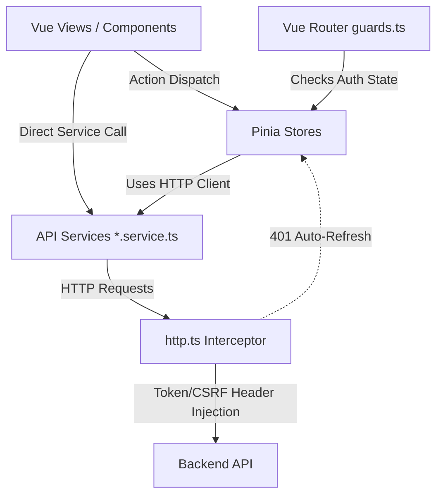

# AliveChMS Frontend Codebase Analysis & Audit Report

This report extends the backend analysis by providing a comprehensive, module-by-module review of the AliveChMS Vue 3 frontend project.

## 1. Architectural Overview

The frontend is a modern Single Page Application (SPA) built with performance, security, and developer experience in mind. 

**Core Tech Stack**:
- **Framework**: Vue 3 (Composition API with `<script setup>`)
- **Build Tool**: Vite
- **Language**: TypeScript
- **State Management**: Pinia
- **Routing**: Vue Router 4
- **HTTP Client**: Axios

### Architecture Highlights
1. **Custom Design System**: Instead of relying on a heavyweight CSS framework (like Vuetify or Bootstrap), the project implements a bespoke UI library in `src/design-system/` (components prefixed with `Ch`, e.g., `ChTable`, `ChButton`). This gives absolute control over branding and reduces bundle bloat.
2. **Auto-Importing**: Uses `unplugin-vue-components` and `unplugin-auto-import` configured in `vite.config.ts`. Design system components and composables are automatically resolved without explicit imports, keeping templates clean.
3. **JS-Driven Theming**: The `useTheme` composable dynamically injects CSS custom properties at runtime, laying the foundation for robust dark mode and dynamic multi-tenant branding.

---

## 2. Module Analysis

### 2.1 Security & HTTP (`src/services/http.ts`, `src/router/guards.ts`)
- **Status**: Secure and robust.
- **Implementation**: 
    - The `http.ts` Axios instance implements an interceptor pipeline. Access tokens are kept strictly in-memory (Auth Store), and CSRF tokens are dynamically attached to modifying headers (`POST`, `PUT`, `DELETE`).
    - Implements an automated `401 Unauthorized` silent-refresh workflow, queueing failed requests while a new token is fetched.
    - `guards.ts` hooks into the router lifecycle to prevent unauthenticated access and supports string-based permission checks at the route metadata level.

### 2.2 State Management (`src/stores/`)
- **Status**: Clean and focused.
- **Implementation**: Pinia stores are used logically. `auth.store.ts` orchestrates login/logout, holds the in-memory access token, and provides derived computed properties (like `isAuthenticated`, `hasPermission`). State doesn't leak into the global object unnecessarily.

### 2.3 Views & Components (`src/views/`)
- **Status**: Standardized and consistent.
- **Implementation**: Feature folders (e.g., `groups/`, `finance/`) map cleanly to backend modules. 
- **Strengths**: Files like `GroupListView.vue` demonstrate a highly decoupled setup: they call `groupService` for data, hold local reactive state to bind filters/pagination to the sophisticated `<ChTable>` component, and cleanly separate logic from template display.

### 2.4 Design System (`src/design-system/`)
- **Status**: Enterprise-grade structure.
- **Implementation**: The custom components are heavily typed and well-documented (e.g., `ChTable` with its built-in Export/Print workflows). 
- **Strengths**: Reusability is extremely high here. A central `index.ts` works as a clean API surface for the rest of the application.

---

## 3. Integration Map

---

## 4. Assessment & Areas for Improvement

**Honest Rating: 9/10**

The frontend is exemplary for a modern Vue 3 application. The choice to build an internal design system pays massive dividends for a long-term enterprise project like a ChMS, preventing vender lock-in with massive UI frameworks. The HTTP interceptor implementation is flawless and highly secure.

### Potential Improvements

1. **Test Coverage**: While `vitest` and `@vue/test-utils` are configured in `package.json`, there aren't obvious broad unit tests natively covering the core utilities and Stores. Ensuring the auth logic and table composables are strictly tested will prevent regressions.
2. **Form Validation Strategy**: Consider standardizing form validation across the views. A utility like `Vuelidate` or `VeeValidate` paired with a schema library (like `Zod` or `Yup`) can simplify complex view files like `EventCreateView.vue` or `FamilyCreateView.vue`. Although I notice `useValidation` is exported from the design system, ensuring it's comprehensive enough across all complex nested forms is critical.
3. **Data Caching / SWR**: Currently, services execute raw HTTP calls on every mount (e.g., `onMounted(() => loadGroups())`). Implementing a caching layer or using a tool like `@tanstack/vue-query` could dramatically improve perceived performance and minimize redundant API calls to the backend, seamlessly caching paginated lists and reducing bandwidth.
